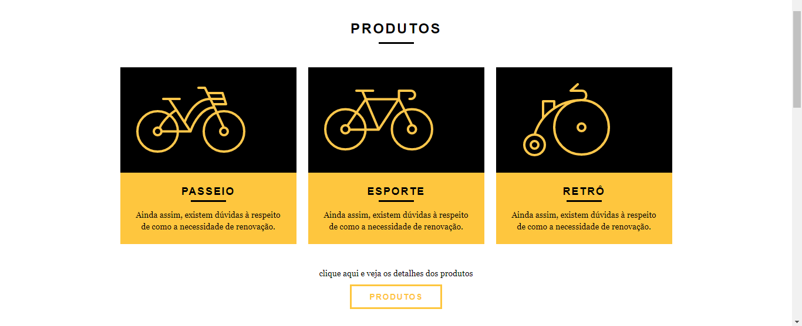
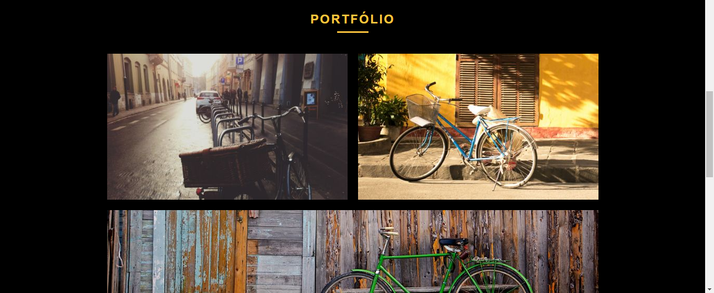
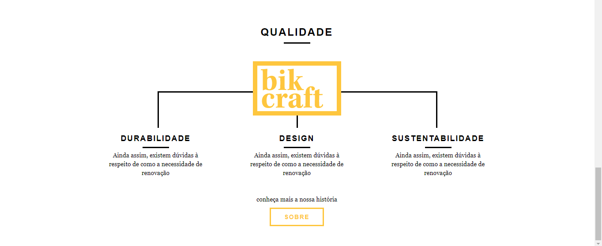

#bikcraftweb
 Webpage Project

<strong>Webpage construída para entendimento da dinâmica de funcionamento do normalize.css, reset.css (Muito utilizados há alguns anos) e o grid.css.</strong>

<strong>Normalize.css:</strong>
 Dá consistência à forma como os elementos são apresentados

<strong>Reset.css:</strong>
 Reseta todas as propriedades dos elementos para que cada uma delas seja declarada

<strong>Grid.css:</strong>
 Pré-setaos antes de iniciar o código hmtl com valores do tamanho das grids, o que deixou o posicionamento dos elementos mais fácil de ser feito.

<strong>Obs.:</strong> Os estilos foram separados em 3 arquivos de css além do styled.css de forma proposital para deixar o entendimento do que foi feito de forma mais clara e organizada.

