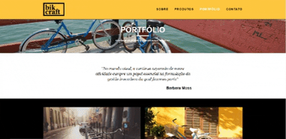
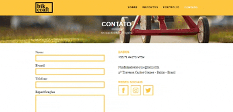
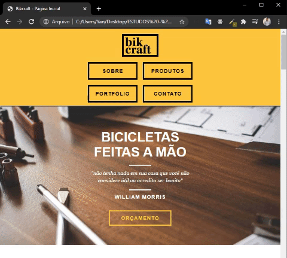

 <h1>Webpage Project - Bikcraft</h1> 

Webpage construída para fins de entendimento da dinâmica de funcionamento do normalize.css, reset.css (Muito utilizados há alguns anos atrás) e o grid.css, bem como todos os detalhes
pertinentes à construção de aplicações Web que utilizam html, css e javascript.
<h2><b>Normalize.css:</b></h2>
 Utilizado para adá consistência à forma como os elementos são apresentados

<h2><b>Reset.css:</b></h2>
 Para resetar todas as propriedades dos elementos para que cada uma delas seja declarada

<h2><b>Grid.css:</b></h2>
 
Pré-setados antes de iniciar o código hmtl com valores do tamanho das grids, o que deixou o posicionamento dos elementos mais fácil de ser feito.
 

<b>Obs.: Os estilos foram separados em arquivos de css diferentes além do styled.css, que contém os estilos da página inicial e alguns estilos comuns para todas as páginas de forma proposital para deixar o entendimento do que foi feito mais claro, porém, ao final do projeto tudo foi colocado em apenas um css para deixar o website mais otimizado se levarmos em consideração o que é aplicado na realidade.</b>
 
<h2><b>Página Inicial</b></h2> 

<h2><b>Página Sobre</b></h2> 

<h2><b>Página Produtos</b></h2> 

<h2><b>Página Portfólio</b></h2> 

<h2><b>Página Contato</b></h2> 

<h2><b>Responsividade Tablet</b></h2>

<h2><b>Responsividade Mobile</b></h2>

 

OBS.: Ao final da aplicação foram implementadas animações nas páginas utilizando um arquivo javascript além de implementação das tags meta na head referentes ao SEO, que em suma, servirá para otimizar o site para os mecanismos de busca, o que é muito utilizado.

